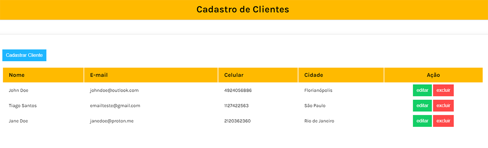

⚠ Projeto ainda em desenvolvimento. Algumas partes não funcionam

# Projeto CRUD de Usuários

Este é um projeto simples de CRUD (Create, Read, Update, Delete) de usuários, onde é possível adicionar, visualizar, atualizar e remover informações de usuários, incluindo nome, email, telefone e cidade.

## Funcionalidades

- Adicionar um novo usuário com os seguintes campos:
  - Nome
  - Email
  - Telefone
  - Cidade

- Visualizar a lista de usuários cadastrados.

- Atualizar informações de um usuário existente.

- Remover um usuário da lista.

[🔗 Clique aqui para acessar](https://tiagow-san.github.io/CRUD)
## 🛠 Tecnologias

- JavaScript
- HTML
- CSS
- Git e Github

